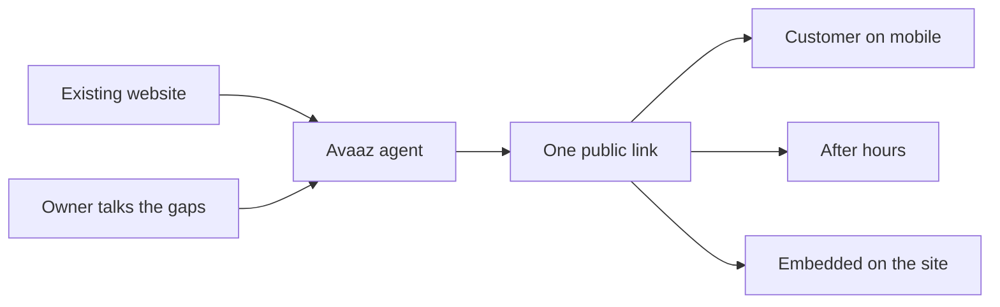
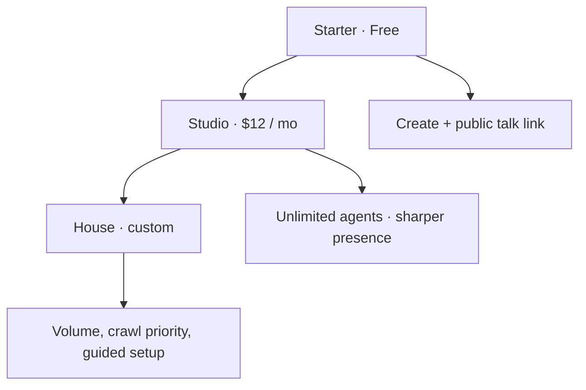
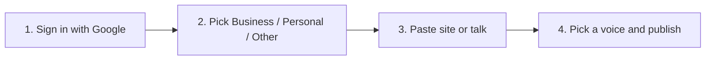
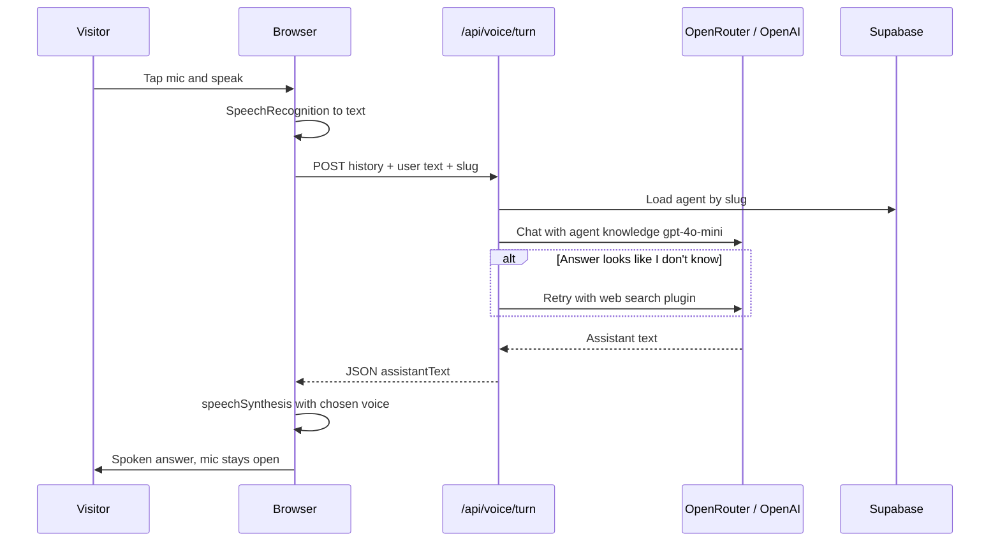
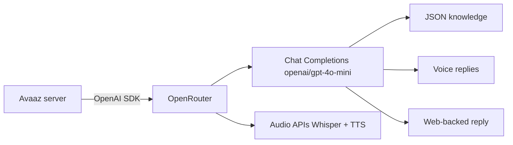
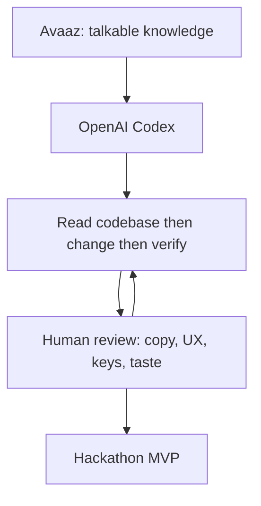
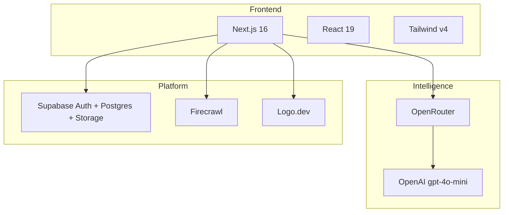

<h1 align="center">
  AVAAZ
</h1>

<p align="center">
  <strong>AI for Voice Agents</strong>
</p>

<p align="center">
  <em>Give your business a voice.</em>
</p>

<p align="center">
  Paste a website. Talk the gaps. Share a live voice agent — in one sitting.
</p>

<p align="center">
  <code>Website → Voice → Agent → Customers talk</code>
</p>

---

**Avaaz** is the voice layer for any business, creator, or campus. It turns a site, a conversation, or a few notes into a public **AI voice agent** anyone can call. Visitors get answers out loud — not another chatbot wall of text.

> **Avaaz — AI for Voice Agents — Give your business a voice.**

| | |
|---|---|
| **Create** | Google sign-in. No code. No widget install. |
| **Go live** | One `/talk` link. Follow. Embed. |
| **Stay on** | Knowledge first. Web search if needed. Mic stays open. |

---

## Table of contents

1. [The business angle](#the-business-angle)
2. [Impact](#impact)
3. [Business model](#business-model)
4. [What it does](#what-it-does)
5. [Why it started](#why-it-started)
6. [Who can use it](#who-can-use-it)
7. [How easy it is](#how-easy-it-is)
8. [Product flow](#product-flow)
9. [System architecture](#system-architecture)
10. [Voice conversation flow](#voice-conversation-flow)
11. [How OpenAI is used](#how-openai-is-used)
12. [How Codex was used](#how-codex-was-used)
13. [Final tech stack](#final-tech-stack)
14. [Setup](#setup)
15. [Routes](#routes)
16. [Featured agents](#featured-agents)

---

## The business angle

Most companies already paid for a website. Almost none of them can *talk*.

Hours, products, pricing, and FAQs sit in pages that customers will not read — especially on a phone, after hours, or while walking in. The default answer is a chat widget that types walls of text, or a human who is closed, busy, or expensive.

**Avaaz’s bet:** if the knowledge exists, it should be a voice in under 10 minutes — not a six-week bot project.

| Problem | What it costs | What Avaaz does |
|---|---|---|
| Unanswered “are you open / how much / do you have X?” | Missed visits and abandoned carts | A public voice that already knows the site |
| Support queues for the same 20 questions | $6–$15 per live-agent contact (typical BPO range) | Deflect FAQs to a shareable agent |
| After-hours silence | Lost demand when the shop is closed | 24/7 talk page, no extra headcount |
| Chatbots nobody finishes | High bounce on long text replies | Speak, hear, keep the mic open |
| Custom “AI agent” builds | Weeks + an engineer | Paste URL → talk gaps → publish |

**Who pays:** the business that owns the knowledge (shop, SaaS, campus, creator). **Who talks for free:** their customers. Distribution is a link or an embed — not an app store.



---

## Impact

Figures below are **market context** (widely cited industry ranges), used to size the problem Avaaz attacks — not live Avaaz production metrics.

| Signal | Number | Why it matters for Avaaz |
|---|---|---|
| Calls small businesses never pick up | **~60%+** unanswered in many local-business studies | A voice agent does not go to voicemail |
| Customers who expect an “immediate” reply | **~80–90%** (service-benchmark surveys) | Voice is faster than finding a FAQ page |
| Speaking vs typing | **~3–4×** faster than typing the same request | Lower effort than a chat box |
| Live support cost per contact | **~$6–$15** typical; AI deflection **cents to ~$1** | FAQ voice pays for itself on a handful of contacts |
| Conversational AI market | **tens of billions USD** this decade (analyst estimates) | Voice is the interface customers already use on phones |
| Time to a traditional custom bot | **weeks** | Avaaz target: **one sitting** |
| Time to an Avaaz agent | **~5–15 minutes** after Google sign-in | Website crawl + a few spoken answers |
| Engineering required | **0** | Owner pastes a URL and talks |

**What changes for a business that ships Avaaz**

| Before | After |
|---|---|
| Site is a brochure | Site becomes something people can *ask* |
| Staff repeat hours, SKUs, policies | Agent recites them; humans take exceptions |
| Closed sign = zero answers | Talk page still listens |
| “Install our widget” friction | One URL, optional embed |

A single deflected “what are your hours / do you deliver / what’s included?” loop, a few times a day, is already more value than a $12 Studio month. Scale is extra agents, extra brands, extra languages later — the wedge is **always-on voice for knowledge that already exists**.

---

## Business model

Short version: **free to create, paid to scale.** The product is the agent. The customer is the owner.



| Plan | Price | What you get | Who it is for |
|---|---|---|---|
| **Starter** | Free | Up to **3** agents, website + voice setup, public talk page | Trying Avaaz, one shop, a campus demo |
| **Studio** | **$12 / month** | Unlimited agents, custom logo & FAQs, follower insights | Teams and multi-brand owners |
| **House** | Talk to us | Priority crawl, team seats, guided setup | Brands that need volume and support |

**How money shows up**

| Motion | Detail |
|---|---|
| **Land** | Free Starter — Google, paste site, go live. No card to try. |
| **Expand** | Studio when a fourth agent, a second brand, or polish is needed |
| **Enterprise** | House — crawl volume, seats, white-glove |
| **Unit cost** | LLM tokens via OpenRouter; live mic/TTS can stay in the browser to keep COGS low |
| **Not in v1** | Ads on talk pages, taking a cut of customer purchases |

Pricing on `/pricing` is display-first for the MVP. The model is SaaS subscription on **agents owned**, not per visitor question.

---

## What it does

**Avaaz** is a voice-first knowledge agent. Four jobs, one product:

| | Capability | What happens |
|---|---|---|
| **1** | **Listen** | Businesses: Firecrawl reads the website. Everyone else: you talk. |
| **2** | **Understand** | OpenAI (via OpenRouter) extracts name, hours, products, FAQs, personality. |
| **3** | **Speak** | Visitors talk on a public page. Answers from knowledge, then the web if needed. |
| **4** | **Share** | One `/talk/[slug]` link. Follow. Copy. Embed. |

Not a generic chatbot with a microphone. The public page is built to listen, answer out loud, and keep the mic open.

---

## Why it started

Knowledge is stuck in a website nobody reads, a PDF nobody opens, or someone’s head.

Typical “AI for business” asks you to fill a CMS, train a bot, then drop a widget. Slow to set up. Awkward on a phone.

Avaaz started as a hackathon MVP with one bet:

> **If the knowledge already exists, talking should be enough to turn it into an agent.**

- Start from a **URL**, not a blank dashboard
- Fill **only the gaps** by voice
- Ship a **public voice page** in one sitting
- Keep the UI light, calm, and shareable on one screen

Designed and directed by [Vansh](https://x.com/provanshh). Built with **OpenAI Codex** as the implementation partner (see [How Codex was used](#how-codex-was-used)).

---

## Who can use it

| Audience | How they use Avaaz | Example |
|---|---|---|
| **Businesses** | Paste the company site → confirm gaps by voice → share with customers | Payments company, restaurant, jewellery shop |
| **Creators** | Talk through who they are → a public voice that introduces them | Portfolio / personal brand |
| **Teachers & campuses** | Point at a site or speak FAQs → students ask out loud | Global Campus X (`/talk/globalcampusx`) |
| **Anyone else** | Choose **Other**, speak the idea | Event, club, side project |
| **Visitors** | Open a talk link — **no account** to ask questions | Google required only to follow |

Creating an agent requires **Google sign-in**. Talking to a public agent does not.

---

## How easy it is

Four steps. Typing is optional after the URL.



| Step | What you do | What Avaaz does |
|---|---|---|
| Sign in | One Google click | Ties agents and follows to you |
| Type | Business / Personal / Other | Routes the create flow |
| Website *(business)* | Paste a URL | Crawls the page, drafts knowledge |
| Voice gaps | Answer only what’s missing | Merges speech into the agent |
| Voice | Nova, Coral, Aria, or Atlas | Distinct female / male voices |
| Share | Copy the link | Anyone talks at `/talk/[slug]` |

**Time to live:** one sitting. No SDK. No prompt engineering from the owner.

---

## Product flow

```mermaid
flowchart TD
  Start([Avaaz /]) --> CTA[Create my agent]
  CTA --> Auth{Signed in?}
  Auth -->|No| Google[Google OAuth]
  Google --> Auth
  Auth -->|Yes| Type[Choose type]

  Type --> Biz[Business]
  Type --> Per[Personal]
  Type --> Oth[Other]

  Biz --> URL[Paste website]
  URL --> Crawl[Firecrawl reads the site]
  Crawl --> Extract[OpenAI extracts structured knowledge]
  Extract --> Gaps[Voice: only missing fields]
  Per --> Talk[Voice onboarding]
  Oth --> Talk
  Gaps --> Know[Knowledge + voice picker]
  Talk --> Know
  Know --> Save[(Supabase agents)]
  Save --> Dash[/agent/slug]
  Dash --> Public[/talk/slug]
  Public --> Listen[Visitor speaks]
  Listen --> Answer[Agent answers from knowledge]
  Answer --> Search{Still unknown?}
  Search -->|Yes| Web[OpenAI + web search]
  Web --> Speak[Browser TTS]
  Search -->|No| Speak
```

---

## System architecture


**Keys stay on the server.** `OPENROUTER_API_KEY`, Firecrawl, and the Supabase service role never ship to the client.

---

## Voice conversation flow

Live talk: **browser** for mic and speech. Server only reasons.



| Layer | Technology | Role |
|---|---|---|
| Speech-to-text (live) | `SpeechRecognition` | Speech → text in the browser |
| Reasoning | OpenAI `gpt-4o-mini` via OpenRouter | Onboarding + public answers |
| Fallback search | OpenRouter `plugins: web` or `:online` | When stored knowledge is not enough |
| Text-to-speech (live) | `speechSynthesis` | Nova / Coral / Aria (female), Atlas (male) |
| Optional STT / TTS | Whisper + OpenAI TTS via OpenRouter | Wired in `lib/openrouter/client.ts` |

---

## How OpenAI is used

Avaaz talks to OpenAI **through OpenRouter** with the official `openai` Node SDK at `https://openrouter.ai/api/v1`. One key, one client, model names like `openai/gpt-4o-mini`.

| Env var | Default | Used for |
|---|---|---|
| `OPENROUTER_CHAT_MODEL` | `openai/gpt-4o-mini` | Extract, onboarding, public Q&A |
| `OPENROUTER_TTS_MODEL` | `openai/gpt-4o-mini-tts-2025-12-15` | Server TTS (optional) |
| `OPENROUTER_STT_MODEL` | `openai/whisper-large-v3` | Server transcription (optional) |



| Job | File | Model returns |
|---|---|---|
| Website → knowledge | `lib/openai/extract.ts` | JSON: name, hours, products, FAQs |
| Voice onboarding | `app/api/voice/turn/route.ts` | Next question, only missing fields |
| Public agent | same + `lib/agents/prompt.ts` | Short spoken answers |
| “I don’t know” | same, `search: true` | Web answer, prefer official site |

The OpenAI key never appears in the browser.

---

## How Codex was used

Avaaz was built as a **directed pairing session with OpenAI Codex** — not an unattended dump. Vansh set product taste (voice-first, light UI, talk-the-gaps). Codex implemented, refactored, and iterated against a running app.



| Area | What Codex helped ship |
|---|---|
| **App shell** | Next.js App Router, Tailwind v4, navbar, footer, about, pricing |
| **Create flow** | Category → website crawl → voice gaps → knowledge → generating |
| **Voice UX** | Mic that stays open, stop-while-speaking, history, voice picker |
| **APIs** | `/api/voice/turn`, website extract, agents CRUD, follow |
| **Data** | `supabase/schema.sql`, featured agents, follow counts |
| **Integrations** | OpenRouter / OpenAI client, Firecrawl, Logo.dev, Google OAuth |
| **Polish** | Gallery, DriftWall, About, this README |

**Rules while using Codex**

- Product decisions stay with the human
- Secrets stay in `.env.local` — never committed, never echoed
- OpenRouter / service keys stay **server-only**
- Iterate on a running app, not a disconnected prototype

Codex was the implementation partner. The intent — *give your business a voice* — is human.

---

## Final tech stack

| Layer | Choice | Role in Avaaz |
|---|---|---|
| **App** | Next.js 16 (App Router) | Pages, RSC, `/api` in one repo |
| **UI** | React 19 + TypeScript | Type-safe product UI |
| **Style** | Tailwind CSS v4 | Light, calm marketing + talk page |
| **Auth** | Supabase Auth (Google) | Create + follow |
| **Database** | Supabase Postgres | Agents, files, conversations, follows |
| **Files** | Supabase Storage `agent-files` | Optional uploads |
| **LLM** | OpenAI `gpt-4o-mini` via OpenRouter | Extract, interview, answers, web fallback |
| **Optional audio** | Whisper + OpenAI TTS via OpenRouter | Server STT / TTS if credits allow |
| **Live voice I/O** | Web Speech API | Mic + playback with low COGS |
| **Crawl** | Firecrawl | Business website → text |
| **Logos** | Logo.dev | Gallery and talk-page marks |
| **Icons** | lucide-react | UI |
| **Docs / PDFs** | mammoth, unpdf | Knowledge uploads |
| **Share** | qrcode | Dashboard / share flows |
| **Build partner** | OpenAI Codex | Implementation speed |



---

## Setup

```bash
npm install
cp .env.example .env.local
```

Fill keys in `.env.local`, then run `supabase/schema.sql` in the Supabase SQL editor.

```bash
npm run dev
```

Open [http://localhost:3000](http://localhost:3000).

### Environment variables

| Variable | Required | Used for |
|---|---|---|
| `OPENROUTER_API_KEY` | Yes (voice + extract) | Server-only OpenAI calls |
| `NEXT_PUBLIC_SUPABASE_URL` | Yes | Auth + data |
| `NEXT_PUBLIC_SUPABASE_ANON_KEY` | Yes | Publishable key |
| `SUPABASE_SERVICE_ROLE_KEY` | Optional | Server uploads |
| `FIRECRAWL_API_KEY` | For website create | Crawl business sites |
| `NEXT_PUBLIC_SITE_URL` | Optional | OpenRouter attribution |
| `NEXT_PUBLIC_LOGO_DEV_TOKEN` | Optional | Company logos |
| `OPENROUTER_CHAT_MODEL` | Optional | Defaults to `openai/gpt-4o-mini` |

Never put `OPENROUTER_API_KEY` or `SUPABASE_SERVICE_ROLE_KEY` in client code.

**Google login:** enable Google in Supabase Auth. Add `http://localhost:3000/auth/callback` (and production) to the redirect allow list.

---

## Routes

| Path | Who it’s for |
|---|---|
| `/` | Landing, how it works, gallery |
| `/about` | Overview, products, why Avaaz |
| `/pricing` | Starter / Studio / House |
| `/create` | Business / Personal / Other |
| `/create/website` | Paste URL (business) |
| `/create/voice` | Talk the gaps |
| `/create/knowledge` | Files + voice picker |
| `/create/generating` | Build the agent |
| `/agent/[slug]` | Owner dashboard |
| `/talk/[slug]` | Public voice (`?embed=1` for embed) |
| `/auth/callback` | Google OAuth return |

---

## Featured agents

Try talk pages without creating one:

| Agent | Talk path | Site |
|---|---|---|
| Dodo Payments | `/talk/dodo-payments` | dodopayments.com |
| Post Bridge | `/talk/post-bridge` | post-bridge.com |
| Supabase | `/talk/supabase` | supabase.com |
| Global Campus X | `/talk/globalcampusx` | globalcampusx.com |

---

## Local walkthrough

1. Open `/`
2. **Create my agent** → Google
3. Choose **Business**
4. Paste a website (or skip to voice for Personal / Other)
5. Answer only the missing questions out loud
6. Pick **Nova**, **Coral**, **Aria**, or **Atlas**
7. Open the public agent and ask *What do you do?* / *What are your hours?*
8. Share the `/talk/[slug]` link

---

## Security notes

- OpenRouter and service-role keys are server-only
- Public talk pages are meant to be shared; do not put secrets in agent knowledge
- Schema RLS is open for the hackathon MVP — tighten before production

---

<p align="center">
  <strong>AVAAZ</strong><br>
  AI for Voice Agents<br>
  <em>Give your business a voice.</em>
</p>

<p align="center">
  Made by <a href="https://x.com/provanshh">Vansh</a>
  · OpenAI Codex · OpenAI via OpenRouter · Next.js · Supabase
</p>
