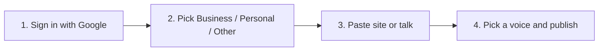
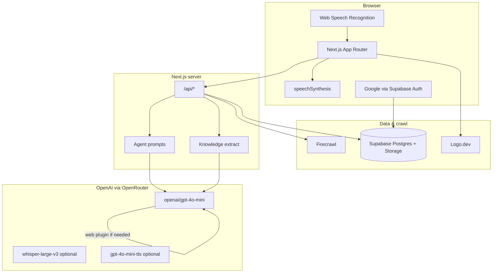
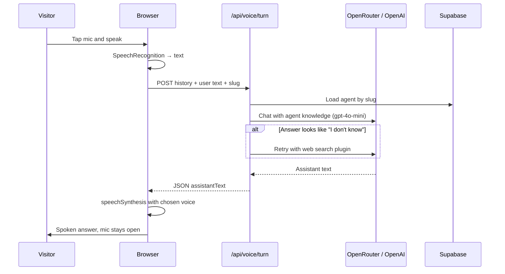
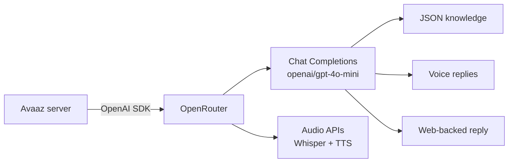
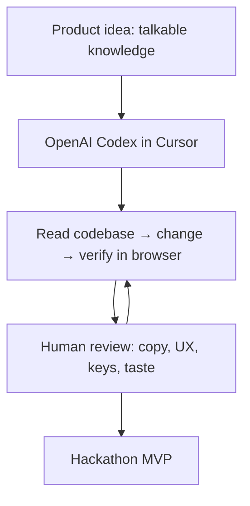

# Avaaz

**Give your knowledge a voice.**

Avaaz turns a website, a conversation, or a few notes into a public **AI voice agent** anyone can talk to. Businesses paste a URL. People speak what’s missing. Visitors get answers out loud — not another chatbot wall of text.

No code. Google sign-in to create. One link to share.

```
Paste a site  →  Talk the gaps  →  Pick a voice  →  Share the agent
```

---

## Table of contents

1. [What it does](#what-it-does)
2. [Why it started](#why-it-started)
3. [Who can use it](#who-can-use-it)
4. [How easy it is](#how-easy-it-is)
5. [Product flow](#product-flow)
6. [System architecture](#system-architecture)
7. [Voice conversation flow](#voice-conversation-flow)
8. [How OpenAI is used](#how-openai-is-used)
9. [How Codex was used](#how-codex-was-used)
10. [Stack](#stack)
11. [Setup](#setup)
12. [Routes](#routes)
13. [Featured agents](#featured-agents)

---

## What it does

Avaaz is a **voice-first knowledge agent**. It does four jobs in one product:

| Capability | What happens |
|---|---|
| **Listen** | For businesses, Firecrawl reads the website. For everyone else, you talk. |
| **Understand** | OpenAI (via OpenRouter) extracts name, hours, products, FAQs, and personality into structured knowledge. |
| **Speak** | Visitors talk to a public page. The agent answers from that knowledge, then searches the web if needed. |
| **Share** | One `/talk/[slug]` link, follow, copy, and an embed snippet. |

It is **not** a generic chatbot with a microphone bolted on. The public page is built to listen, answer out loud, and keep the mic open.

---

## Why it started

Knowledge is usually stuck in three places: a website nobody reads, a PDF nobody opens, or someone’s head.

Typical “AI for business” tools ask you to fill a CMS, train a bot, then drop a chat widget that dumps paragraphs. That is slow to set up and awkward to use — especially for a shop, a creator, a campus, or a person who just wants to be *asked* something.

Avaaz started as a hackathon MVP with a simpler bet:

> **If the knowledge already exists, talking should be enough to turn it into an agent.**

That meant:

- Start from a **URL**, not a blank dashboard
- Fill **only the gaps** by voice
- Ship a **public voice page** in one sitting
- Keep the UI light, calm, and shareable on a single screen

The project was designed and directed by [Vansh](https://x.com/provanshh). Implementation moved fast with **OpenAI Codex** in Cursor (see [How Codex was used](#how-codex-was-used)).

---

## Who can use it

| Audience | How they use Avaaz | Example |
|---|---|---|
| **Businesses** | Paste the company site → confirm gaps by voice → share with customers | Payments company, restaurant, jewellery shop |
| **Creators** | Talk through who they are → public voice that introduces them | Portfolio / personal brand |
| **Teachers & campuses** | Point at a site or speak FAQs → students ask out loud | Global Campus X (`/talk/globalcampusx`) |
| **Anyone else** | Choose **Other**, speak the idea | Event, club, side project |
| **Visitors** | Open a talk link — **no account required** to ask questions | Followers need Google to follow |

Creating an agent requires **Google sign-in** (Supabase Auth) so agents stay tied to an owner. Talking to a public agent does not.

---

## How easy it is

Setup is four steps. Typing is optional after the URL.



| Step | What you do | What Avaaz does |
|---|---|---|
| Sign in | One Google click | Ties agents and follows to you |
| Type | Business / Personal / Other | Routes the create flow |
| Website *(business)* | Paste a URL | Crawls the page, drafts knowledge |
| Voice gaps | Answer only what’s missing | Merges speech into the agent |
| Voice | Choose Nova, Coral, Aria, or Atlas | Maps to a distinct browser voice |
| Share | Copy the link | Anyone can talk at `/talk/[slug]` |

**Time to a live agent:** one sitting. No SDK, no widget install, no prompt engineering required from the owner.

---

## Product flow

```mermaid
flowchart TD
  Start([Landing /]) --> CTA[Create my agent]
  CTA --> Auth{Signed in?}
  Auth -->|No| Google[Google OAuth]
  Google --> Auth
  Auth -->|Yes| Type[Choose type]

  Type --> Biz[Business]
  Type --> Per[Personal]
  Type --> Oth[Other]

  Biz --> URL[Paste website]
  URL --> Crawl[Firecrawl reads the site]
  Crawl --> Extract[OpenAI extracts structured knowledge]
  Extract --> Gaps[Voice: only missing fields]
  Per --> Talk[Voice onboarding]
  Oth --> Talk
  Gaps --> Know[Knowledge + voice picker]
  Talk --> Know
  Know --> Save[(Supabase agents)]
  Save --> Dash[/agent/slug]
  Dash --> Public[/talk/slug]
  Public --> Listen[Visitor speaks]
  Listen --> Answer[Agent answers from knowledge]
  Answer --> Search{Still unknown?}
  Search -->|Yes| Web[OpenAI + web search]
  Web --> Speak[Browser TTS]
  Search -->|No| Speak
```

---

## System architecture



**Keys stay on the server.** `OPENROUTER_API_KEY`, Firecrawl, and the Supabase service role never ship to the client.

---

## Voice conversation flow

Live talk uses the **browser** for mic and speech. The server only reasons.



| Layer | Technology | Role |
|---|---|---|
| Speech-to-text (live) | `SpeechRecognition` / `webkitSpeechRecognition` | Turn speech into text in the browser |
| Reasoning | OpenAI `gpt-4o-mini` via OpenRouter | Onboarding questions + public answers |
| Fallback search | OpenRouter `plugins: web` or `:online` | Used only if stored knowledge is not enough |
| Text-to-speech (live) | `speechSynthesis` | Nova / Coral / Aria (female), Atlas (male) |
| Optional STT / TTS | Whisper + OpenAI TTS via OpenRouter | Wired in `lib/openrouter/client.ts` if credits are available |

---

## How OpenAI is used

Avaaz talks to OpenAI **through OpenRouter** using the official `openai` Node SDK pointed at `https://openrouter.ai/api/v1`. That keeps one API key, one client, and model names like `openai/gpt-4o-mini`.

Default models (overridable in `.env.local`):

| Env var | Default | Used for |
|---|---|---|
| `OPENROUTER_CHAT_MODEL` | `openai/gpt-4o-mini` | Knowledge extraction, onboarding interview, public Q&A |
| `OPENROUTER_TTS_MODEL` | `openai/gpt-4o-mini-tts-2025-12-15` | Server TTS (optional) |
| `OPENROUTER_STT_MODEL` | `openai/whisper-large-v3` | Server transcription (optional) |



### Where GPT runs in the product

| Job | File | What the model returns |
|---|---|---|
| Website → knowledge | `lib/openai/extract.ts` | JSON: name, hours, products, FAQs, personality |
| Voice onboarding | `app/api/voice/turn/route.ts` | Next interview question, only about missing fields |
| Public agent | same route + `lib/agents/prompt.ts` | Short spoken answers from stored knowledge |
| “I don’t know” | same route, `search: true` | Answer from the web, prefer the official site |

The OpenAI key never appears in the browser. The client sends **text**; the model sees the agent prompt and conversation history on the server.

---

## How Codex was used

This repo was built as a **directed pairing session with OpenAI Codex in Cursor** — not as an unattended code dump. Vansh set product taste (voice-first, light UI, talk-the-gaps). Codex implemented, refactored, and iterated against a running `next dev`.



| Area | What Codex helped ship |
|---|---|
| **App shell** | Next.js App Router, Tailwind v4, navbar, footer, about, pricing |
| **Create flow** | Category → website crawl → voice gaps → knowledge → generating |
| **Voice UX** | Mic that stays open, stop-while-speaking, history accordion, voice picker |
| **APIs** | `/api/voice/turn`, website extract, agents CRUD, follow |
| **Data** | `supabase/schema.sql`, featured agents, follow counts |
| **Integrations** | OpenRouter/OpenAI client, Firecrawl, Logo.dev, Google OAuth |
| **Polish** | Gallery cards, DriftWall logos, About sections, README |

**Rules we kept while using Codex:**

- Product decisions stay with the human (copy, layout, what “easy” means)
- Secrets stay in `.env.local` — never committed, never echoed
- OpenRouter / service keys stay **server-only**
- Iterate on a running app instead of generating a disconnected prototype

Codex was the implementation partner. The product intent — *knowledge should be easy to talk to* — is human.

---

## Stack

| Layer | Choice | Why |
|---|---|---|
| App | Next.js 16 App Router, React 19, TypeScript | Routes, server APIs, and UI in one repo |
| Style | Tailwind CSS v4 | Light, calm marketing + product UI |
| Auth | Supabase Auth (Google) | Create and follow without a custom user table |
| Database | Supabase Postgres | Agents, files, conversations, follows |
| Files | Supabase Storage `agent-files` | Optional uploads |
| LLM | OpenAI via OpenRouter | Chat, optional Whisper / TTS |
| Crawl | Firecrawl | Business website → text |
| Logos | Logo.dev | Gallery and talk-page marks |
| Voice I/O | Web Speech API | Zero extra credits for live mic + playback |

---

## Setup

```bash
npm install
cp .env.example .env.local
```

Fill keys in `.env.local`, then run `supabase/schema.sql` in the Supabase SQL editor.

```bash
npm run dev
```

Open [http://localhost:3000](http://localhost:3000).

### Environment variables

| Variable | Required | Used for |
|---|---|---|
| `OPENROUTER_API_KEY` | Yes (voice + extract) | Server-only OpenAI calls |
| `NEXT_PUBLIC_SUPABASE_URL` | Yes | Auth + data |
| `NEXT_PUBLIC_SUPABASE_ANON_KEY` | Yes | Publishable key |
| `SUPABASE_SERVICE_ROLE_KEY` | Optional | Server uploads |
| `FIRECRAWL_API_KEY` | For website create | Crawl business sites |
| `NEXT_PUBLIC_SITE_URL` | Optional | OpenRouter attribution |
| `NEXT_PUBLIC_LOGO_DEV_TOKEN` | Optional | Company logos |
| `OPENROUTER_CHAT_MODEL` | Optional | Defaults to `openai/gpt-4o-mini` |

Never put `OPENROUTER_API_KEY` or `SUPABASE_SERVICE_ROLE_KEY` in client code.

**Google login:** enable the Google provider in Supabase Auth. Add `http://localhost:3000/auth/callback` (and production) to the redirect allow list.

---

## Routes

| Path | Who it’s for |
|---|---|
| `/` | Landing, how it works, gallery |
| `/about` | Overview, products, why Avaaz |
| `/pricing` | Display plans (try without paying) |
| `/create` | Type: Business / Personal / Other |
| `/create/website` | Paste URL (business) |
| `/create/voice` | Talk the gaps |
| `/create/knowledge` | Files + voice picker |
| `/create/generating` | Build the agent |
| `/agent/[slug]` | Owner dashboard |
| `/talk/[slug]` | Public voice page (`?embed=1` for embed) |
| `/auth/callback` | Google OAuth return |

---

## Featured agents

Try the public talk pages without creating one:

| Agent | Talk path | Site |
|---|---|---|
| Dodo Payments | `/talk/dodo-payments` | dodopayments.com |
| Post Bridge | `/talk/post-bridge` | post-bridge.com |
| Supabase | `/talk/supabase` | supabase.com |
| Global Campus X | `/talk/globalcampusx` | globalcampusx.com |

---

## Local walkthrough

1. Open `/`
2. **Create my agent** → Google
3. Choose **Business**
4. Paste a website (or skip to voice for Personal / Other)
5. Answer only the missing questions out loud
6. Pick **Nova**, **Coral**, **Aria**, or **Atlas**
7. Open the public agent and ask *What do you do?* / *What are your hours?*
8. Share the `/talk/[slug]` link

---

## Security notes

- OpenRouter and service-role keys are server-only
- Public talk pages are meant to be shared; do not put secrets in agent knowledge
- Schema RLS is open for the hackathon MVP — tighten before production

---

## Author

Made by [Vansh](https://x.com/provanshh). Built with OpenAI Codex in Cursor, OpenAI models via OpenRouter, Next.js, and Supabase.
